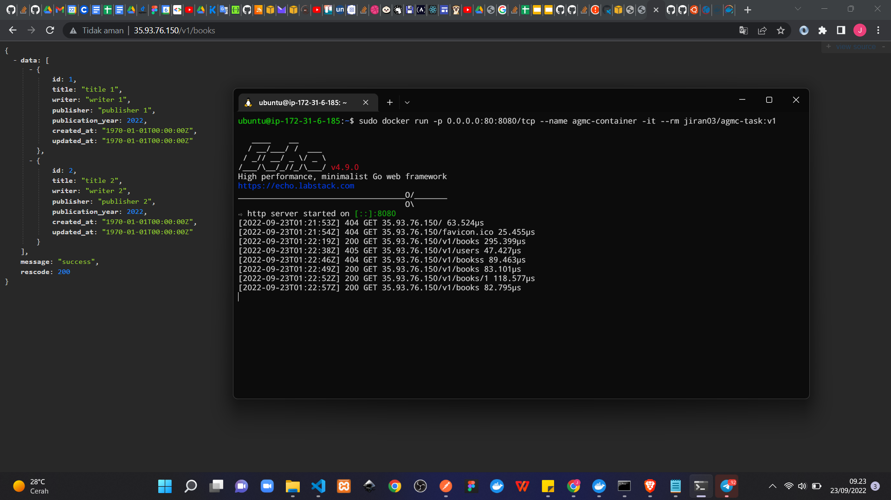

# Step by Step Deployment Tugas Day 8

## Membuat EC2

1. Buka dan login ke *AWS Console*, kemudian pada pencarian ketik EC2, pilih EC2 kemudian klik button ***Launch Instance*** untuk membuat instance baru.
   
   
   
2. Masukkan nama dari servis yang akan dibuat dan pilih OS yang akan digunakan.
   
   

3. Pada bagian *Key Pair* klik ***Create new key pair***. Kemudian masukkan nama key pair lalu sesuaikan type dan format file dari key pair yang akan dibuat.
   
   

4. Pada bagian *Network setting* klik button ***Edit***. Kemudian sesuaikan *security group* dari instance seperti berikut. Setelah itu klik ***Launch Instance***.
   
   

5. Jika instance berhasil dibuat, maka tampilannya akan seperti berikut.
   
   

## Melakukan Koneksi ke Server dengan SSH

1. Buka terminal, kemudian masukkan perintah berikut `ssh -i <KEY_PAIR> <HOST>@<PUBLIC_IPv4_ADDRESS_EC2>`
   
   

## Konfigurasi Database

1. Buka AWS Console, kemudian pada pencarian ketik RDS.
   
   

2. Setelah itu klik ***Create database***.
   
   

3. Kemudian pilih ***standard method***. Lalu pilih *Engine type*-nya, di sini saya menggunakan *MySQL*.
   
   

4. Pilih versi dari *engine type* tadi, kemudian untuk *Template* gunakan ***Free tier***. 
   
   

5. Kemudian pada bagian *Setting* masukkan nama dari *DB instance* serta masukkan juga *username* dan *password* yang akan digunakan untuk mengakses database nantinya.
   
   

6. Pada Instance configuration sesuaikan dengan kebutuhan masing-masing.
   
   

7. Pada bagian *Storage*, sesuaikan dengan kebutuhan. Pada kali ini saya menghilangkan centang pada bagian ***Enable storage autoscaling*** karena tujuan saya menggunakan database ini hanya untuk melakukan tes deployment.
   
   

8. Pada bagian *Connectivity* pilih ***Connect to an EC2 compute resource*** kemudian pilih instance EC2 yang telah dibuat sebelumnya.
   
   

9. Pada bagian ***Database port*** masukkan port 3306.
    
   

10. Kemudian klik ***Create database***.
    
    

11. Setelah itu buka kembali terminal dan login ke EC2 yang telah dibuat sebelumnya. Kemudian install *mysql* pada server. 
    
    

12. Buka kembali AWS Console, kemudian masuk ke RDS yang telah dibuat sebelumnya lalu *copy* ***Endpoint*** -nya.
    
    

13. Setelah itu buka kembali terminal lalu pada terminal ketik `sudo mysql -h <RDS_ENDPOINT> -u <RDS_DB_USERNAME> -p`. Kemudian masukkan *password* yang telah dibuat pada RDS sebelumnya. Lalu buat database dengan menggunakan perintah `CREATE DATABASE <DB_NAME>;`.
    
    

## Deploy menggunakan Docker
1. Buka file `.env` pada project, kemudian sesuaikan *environment* nya dengan yang ada pada RDS dan database yang telah dibuat pada server. Setelah itu *build* dan *push* image yang telah dibuat ke Dockerhub.
   
   

2. Setelah itu, buka kembali terminal kemudian pull image yang telah dibuat sebelumnya dari Dockerhub ke server dengan menggunakan perintah `docker pull <IMAGE>:<IMAGE_TAG>` 
   
   

3. Setelah itu lakukan perintah *docker run* untuk menjalankan image di dalam docker container. `docker run -p <OUT_PORT>:<IN_PORT>/tcp --name <CONTAINER_NAME> -it --rm <IMAGE>:<IMAGE_TAG>`
   
   

4. Untuk melihat apakah deploy yang dilakukan sudah berhasil, silakan buka browser dan akses *endpoint* yang telah dibuat dengan menggunakan host dari ***Public IPv4 address*** dari server EC2 yang telah dibuat sebelumnya.
   
   
